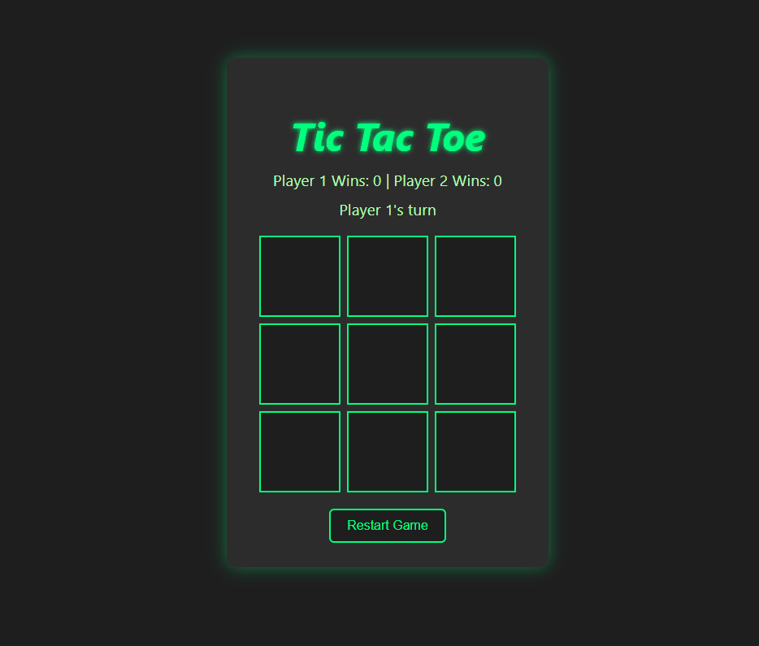
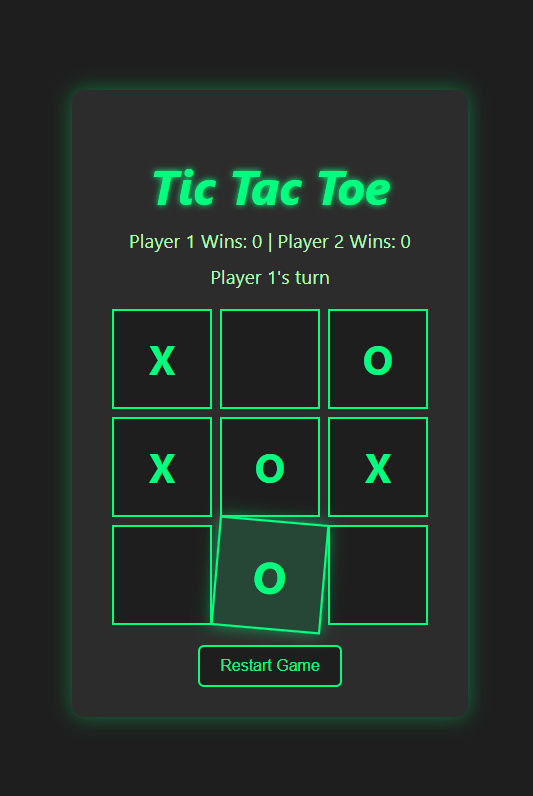
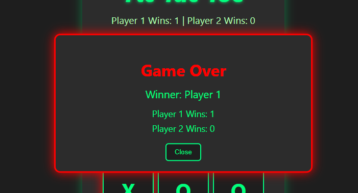
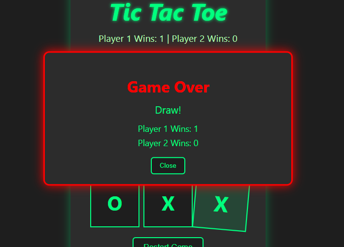

# Tic Tac Toe Pro

A visually engaging **Tic Tac Toe** web game built with **HTML, CSS, and JavaScript** featuring a modern gaming theme.

## Features

- Dark grey & neon green gaming style  
- Italic heading with glowing effect  
- Two players: **Jamie Lannister** & **Tyrion Lannister**  
- Animated **popup** on win or draw (fade + scale)  
- Hover effects & winning line highlight  
- Live **scoreboard** tracking wins  
- Restart game functionality  

## Screenshots

| Gameplay | Winning Moment | Another View | Draw Screen |
|:---------:|:---------------:|:-------------:|:------------:|
|  |  |  |  |

> Example screenshots from different game states.

## How to Play

1. Open `index.html` in a browser.  
2. Players take turns clicking empty cells to place their mark.  
3. First player to align three marks horizontally, vertically, or diagonally wins.  
4. If all cells are filled without a winner, the game ends in a draw.  
5. Click **Restart Game** to start a new round.

## Tech Stack

- HTML5  
- CSS3 (Grid, Animations, Hover effects)  
- Vanilla JavaScript  

## Demo

Just clone the repository and open `index.html` in any modern browser to play.  

